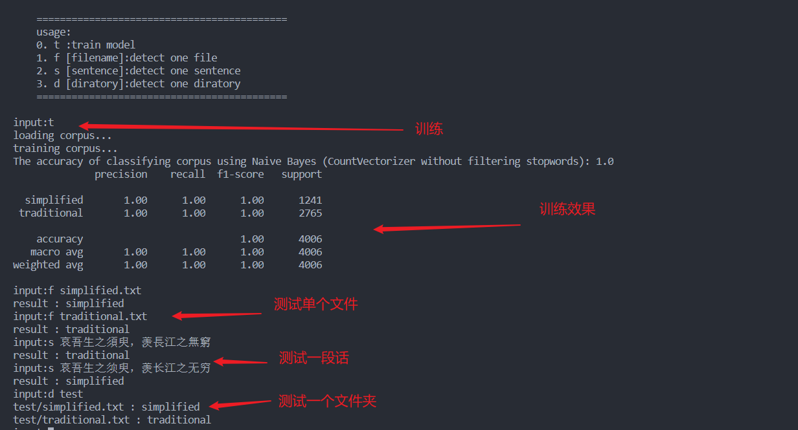

**获取模型**  
主要步骤：  

1. 文本预处理，提取语料中的中文
2. 向量化
3. 训练
4. 存储模型

主要使用工具：   
`scikit-learn`的`GaussianNB`(朴素贝叶斯模型)和`CountVectorizer`(获取词向量)

**预测文本**  
提供三种方式预测  
```
    ===========================================
    usage:
    1. t :train model
    2. f [filename]:detect one file
    3. s [sentence]:detect one sentence
    4. d [diratory]:detect one diratory
    ===========================================
```

**运行效果**  

<div align="center">


</div>

**运行方法**  
安装scikit-learn代码库  
运行`python detect.py`  

